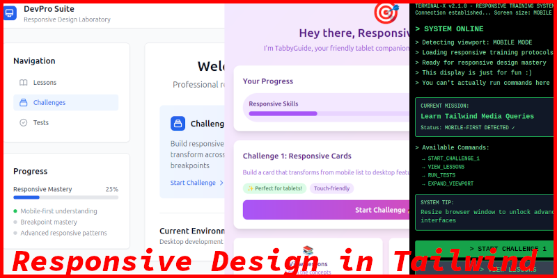
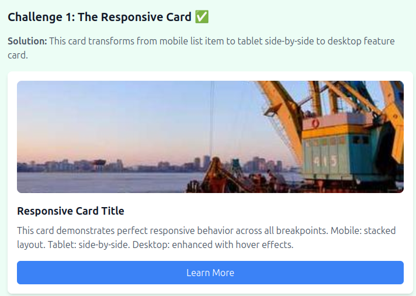
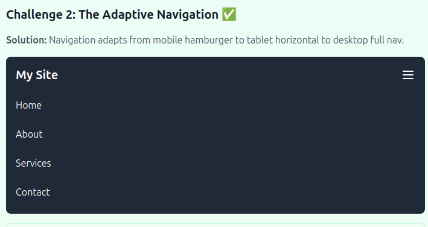
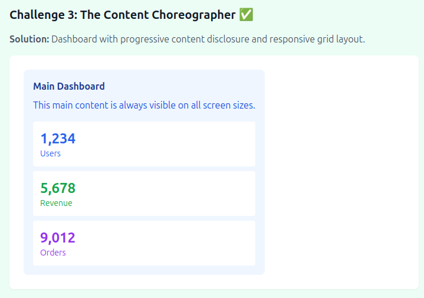

# Tailwind Media Queries



## Core Concept
- **Topic**: Tailwind Media Queries
- **Learning Objective**: Students will be able to create responsive layouts using Tailwind's breakpoint utilities (sm:, md:, lg:, xl:, 2xl:) and understand mobile-first design principles
- **Estimated Duration**: 3 hours
- **Prerequisite Knowledge**: HTML structure, CSS basics, Tailwind utility classes, basic understanding of responsive design concepts

## Getting Started

1. Run `npm run serve` to start the lab server and open the dashboard
   - This will open the dashboard interface in your browser
   - If it doesn't open automatically, navigate to `http://localhost:8080/dashboard/index.html`
2. Resize your browser window to see the dashboard transform
    - **Mobile (< 640px)**: Terminal-style interface with "TERMINAL-X" persona
    - **Tablet (640px - 1024px)**: Playful interface with "TabbyGuide" persona
    - **Desktop (1024px+)**: Professional developer environment with "DevPro Suite" persona
    >Note that the dashboard is only meant to be an example of what responsive design can achieve -- its functionality is limited to directing you to the lessons and to the lab!
3. Read the lessons, starting with [intro.md](https://github.com/rwonja/w2_css_tailwind_media_queries/blob/main/lessons/intro.md), to understand responsive design principles in Tailwind
4. Follow the challenges in order, working in `lab/starter-template.html` -- the source code contains comments and TODOs to guide you
5. Run tests with `npm test` or `npm run test:verbose` to check your progress (or use the "Run Tests" button on the lab dashboard)

## Challenges

### Challenge 1 - The Responsive Card
Build a card component that transforms from a compact mobile list item to an expanded desktop feature.



### Challenge 2 - The Adaptive Navigation
Create navigation that shape-shifts like the lab itself:
- Mobile: Hamburger menu with slide-out drawer
- Tablet: Bottom tab bar with icons
- Desktop: Traditional top navigation with dropdowns



### Challenge 3 - The Content Choreographer
Build a dashboard where components appear/disappear/reorder based on screen size.



## Key Learning Points

- **Mobile-First Design**: Start with mobile styles, then enhance for larger screens
- **Breakpoint Utilities**: Use `sm:`, `md:`, `lg:`, `xl:`, `2xl:` prefixes
- **Responsive Utilities**: Show/hide content with responsive display classes
- **Layout Adaptation**: Transform layouts completely at different screen sizes

## File Structure

```
/lessons
  - intro.md              # Introduction to responsive design
  - mobile-first.md       # Mobile-first methodology
  - breakpoint-reference.md # Tailwind breakpoint reference

/lab
  - starter-template.html # Your working file
  - solution-template.html # Example solution for reference

/dashboard                # Dashboard interface (No need to modify these files)
/tests                    # Automated tests (You don't need to worry about these files)
/assets                   # Image for the readme (You don't need to access)
```

## Assessment

- Automated tests check for proper responsive utilities
- Visual regression tests ensure components work at all breakpoints
- Performance scoring based on utility efficiency
- Self-assessment through comparison with solutions

## Rules

1. **Use only Tailwind utility classes** (no custom CSS)
2. **Each component must work at all three major breakpoints**
3. **No inline styles** - encourage utility class usage
4. **Test at each breakpoint** before moving to next challenge

## Getting Help

- Check the lessons folder for detailed explanations
- Check the hints underneath each challenge in `starter-template.html`
- Use the [Tailwind documentation](https://tailwindcss.com/docs/responsive-design) for reference
- Run tests (`npm test`) frequently to catch issues early -- more detailed output can be seen with `npm run test:verbose`
- If you get stuck, refer to the solution template for guidance

---

**Ready to begin?** Run `npm run serve` and start your responsive design journey!
